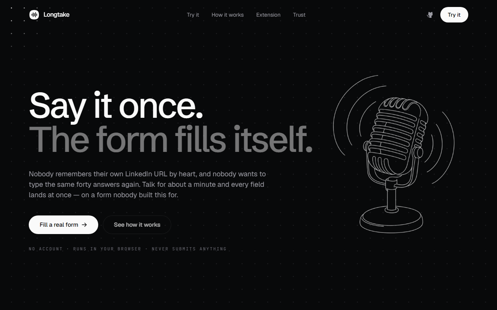
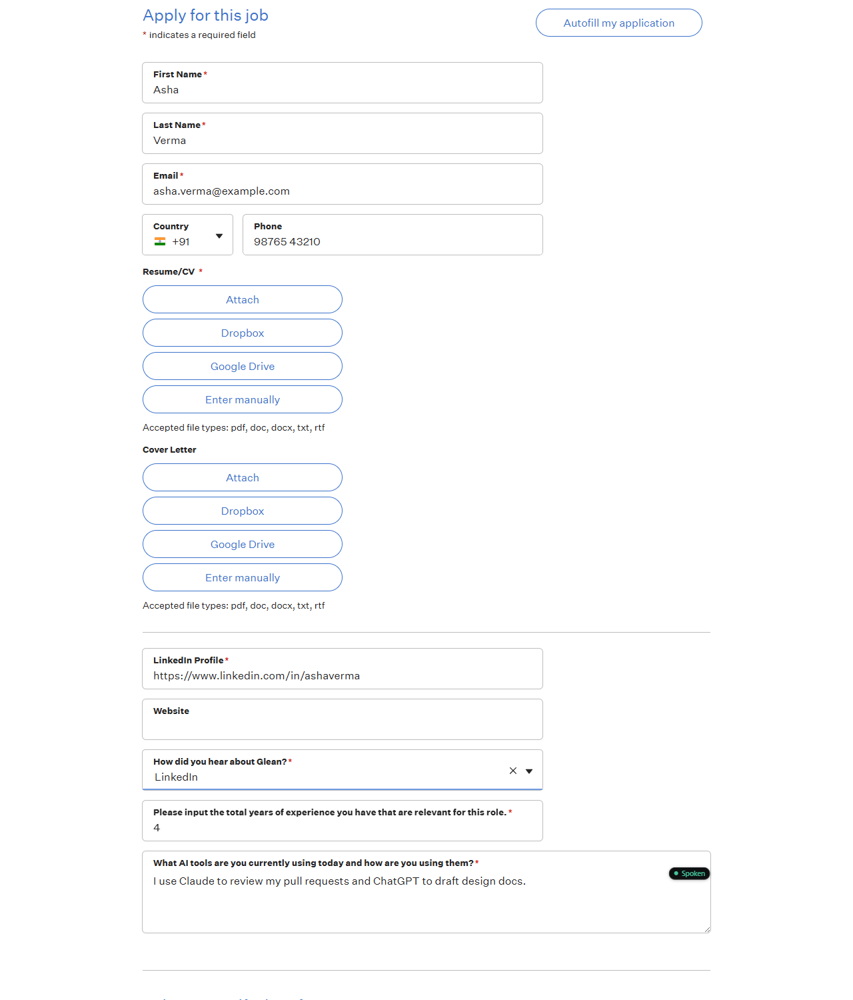
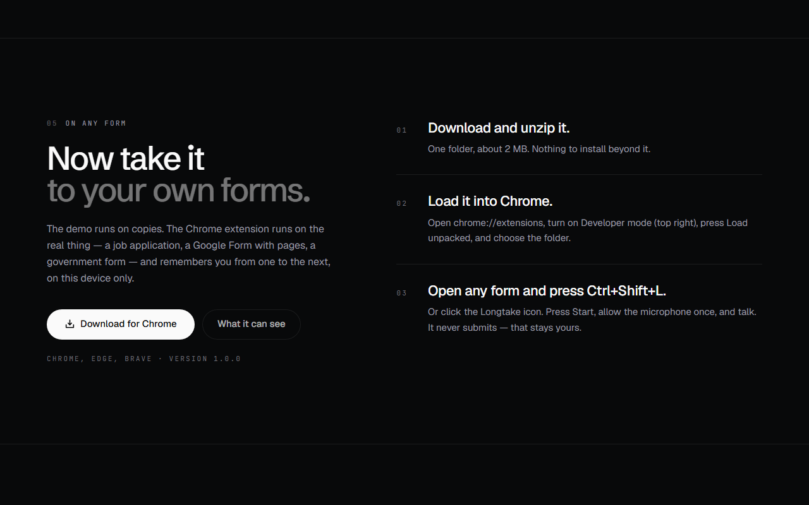

<div align="center">


# Longtake

**The whole form, in one take.**

Talk for a minute, the way you would tell a friend, and a web form you do not own fills itself.
It asks out loud only for what you left out. It never writes an answer you did not give, and it
never presses submit.

[**Try it live**](https://longtake-web.vercel.app) ·
[**Get the Chrome extension**](https://longtake-web.vercel.app/#extension) ·
[What we measured](#we-measured-it-on-21-real-forms) ·
[How it works](#how-it-works) ·
[Built on AssemblyAI](#built-on-assemblyai) ·
[Run it yourself](#run-it-yourself)

</div>

---

## The problem, in numbers

You already know every answer a form asks for. Your name, your email, where you worked, why you
want the job. Typing them in, box after box, is the slow part, and people give up on it.

- **10.5 billion hours.** That is how much time US federal paperwork took from the public in fiscal
  year 2023, by the US government's own count.
- **About 1 in 3** people who start an online form do not finish it (66% of starters complete it).
- **52% of Gen Z and 51% of millennial job seekers** say they have stopped an application before
  finishing it. The same report describes the usual reason: upload your résumé, then fill in a
  separate form with the same details.
- **About 3 times faster.** Speaking is about three times faster than typing on a phone
  (161 against 53 words per minute for English, in a Stanford study).
- **52.8 crore people** in India give Hindi as their mother tongue. Longtake takes answers in Hindi,
  English, or both in the same sentence.

A form is really an interview: forty questions, asked one box at a time, about things you could
answer out loud in a minute. Every voice tool so far gives you one microphone per box. Browser
autofill knows your email but not your answers, and AI form fillers guess, which on a job
application is worse than leaving a box empty.

<sub>Sources: [US OMB Information Collection Budget, FY2023, Table C1](https://bidenwhitehouse.archives.gov/wp-content/uploads/2024/10/FINAL_REV_2023-ICB-Appendix-C-FY-2023-Paperwork-Burden-Accounting-1.pdf)
(10,503 million burden hours, agency estimates, includes businesses) ·
[Zuko form analytics](https://www.zuko.io/blog/25-conversion-rate-statistics-you-need) (vendor data
from its customers' forms) ·
[Indeed, State of the Job Seeker, September 2026](https://www.indeed.com/career-advice/news/job-seeker-burnout-state-of-the-job-seeker-report)
(YouGov survey, 1,501 US adults, self-reported) ·
[Ruan, Wobbrock, Liou, Ng, Landay 2016](https://arxiv.org/pdf/1608.07323v1) (lab study; the
peer-reviewed 2018 version reports 2.93×) ·
[Census of India 2011, Statement 4](https://censusindia.gov.in/nada/index.php/catalog/42458/download/46089/C-16_25062018.pdf)
(the Hindi language group). We left out the often-repeated "92% of candidates abandon job
applications": it traces back to a click-through rate on job ads, not people who started a form.</sub>

---

## What it does

<div align="center">

</div>

Open a form and talk. Say your name, your email, where you heard about the job, how many years you
have worked, what tools you use, all in one go, in English, Hindi or a mix of both. The answers land
in the right boxes while you are still talking.

Then it looks at what is still empty and asks for those, a few at a time, out loud. Short questions
come together ("how did you hear about us, and how many years of experience?"). Long ones get their
own turn.

<div align="center">

<br/><sub>A real Glean application on Greenhouse (copied offline, unchanged), filled from one Hinglish paragraph.
A badge beside a field says where its answer came from.</sub>
</div>

### When you say something the form does not offer

Say "Twitter" to a list that has no Twitter, and it offers the closest thing on the list and
**waits for your yes**. Nothing goes in until you agree. The same happens when you sound unsure:
"around four years, I think" is read back to you first.

### Long answers, in your own words

For "Why do you want to work here?" it takes what you said as the answer. If you ask it to tidy it
up, it writes a draft, and every sentence of that draft has to point at something you actually said.
Code checks each one. A sentence that brings in a number, a name or a link you never mentioned is
thrown out before you see it. Then it reads the draft to you word for word, and it only goes in
after you say yes.

### The second form is already half done

What you say is remembered on your device, keyed by what it means: "your email" is the same answer
on a Greenhouse form, a Google Form and a college inquiry form. On the next form it fills what it
already knows, tells you what it filled, and asks only the new questions. If an answer changed
("I moved to Pune"), it asks whether to update it for next time.

You can see, edit, export or delete everything it knows about you. Nothing is kept on a server.

### On any form on the web

<div align="center">

</div>

The site runs on copies of four real forms so anyone can try it without installing anything. The
Chrome extension runs the same code on the real thing: any page, any site, one click on the
Longtake icon in the toolbar. It finds the form even inside an iframe (many careers pages embed Greenhouse
that way), and when a Google Form loads its next page, the call carries on in the same
conversation.

**Install:** download [longtake-extension.zip](https://longtake-web.vercel.app/longtake-extension.zip),
unzip it, open `chrome://extensions`, turn on Developer mode, press **Load unpacked** and choose the
folder. It has been submitted to the Chrome Web Store and is in review.

---

## Three rules, written in code

Each of these is enforced by the program. None of them depends on the model behaving.

**1. It never writes an answer you did not give.** Every value the agent wants to put in comes with
a quote, and the quote is checked against the transcript of what you actually said
(`core/src/evidence.ts`). If the words are not there, the field stays empty. We added this after a
model, asked to fill a form with no input at all, produced a complete applicant, quotes included.
Some forms also hide trap fields that only software would fill. Longtake finds them and never
touches them.

**2. It never submits, and it never says it did.** Longtake types into the page and stops. You read
it and send it yourself. On an early run the agent finished with "All done, I have submitted your
application." It had submitted nothing. The rule now lives in the prompt and in every tool result
(`submitted: false`), because the tool result is what the model reads at the moment it decides what
to say.

**3. It checks its own claims.** After each reply, what the agent said is compared with what is
really in the boxes (`core/src/trust.ts`). If it said "got that in" and the box is empty, it
corrects itself out loud and the field is marked **Not in**.

---

## We measured it on 21 real forms

We captured 21 forms from live websites and wrote down the right answer for every field: job applications on Greenhouse, Lever, Ashby and Workable, Google Forms, Typeform,
Jotform, Microsoft Forms, Tally, a GOV.UK service, HealthCare.gov, the Government of Canada's
visitor tool, a college inquiry form and an event sign-up. Every change to the code is scored
against all of them, and a score that goes down has to be explained before the change stays.

| What we checked | Result |
|---|---|
| Questions found and read correctly (314 fields, 21 forms) | **100%** |
| Required fields spotted | **98.5%** (3 date parts on one GOV.UK page are missed) |
| Hidden trap fields filled | **0** |
| Answers that land correctly (236 answers, 20 forms) | **100%** |
| Fields changed that nobody spoke to | **0** |
| Conversation checks passed (272 checks, 20 scripted conversations) | **100%** |
| Times it corrected itself when nothing was wrong | **0** |
| Made-up "got that in" claims caught | **12 of 13** |
| What each question means, right (315 fields) | **90.8%** |
| Someone else's details read as yours (an emergency contact's phone, say) | **0** |
| Returning person: known answers filled or offered for a yes | **100%** (25 answers, 5 form pairs) |
| Returning person: known answers asked again | **0** |
| Long-answer drafts with an invented sentence (live model) | **0 of 8** |
| Time to read a form (median / slowest 5%) | **17 ms / 63 ms** |

<sub>How this was measured. Forms are recorded from the live sites and replayed offline, so a score
cannot change because a site changed. The right answers for 6 forms were checked by a person; the
other 15 were checked by a separate AI review agent, not by a person. The conversations are
scripted (the agent's words are fixed), and they run through the same code as the website and the
extension; the check on the agent's claims uses the real model's recorded answers. The one missed
lie is on the Discord form, where the checking model returned nothing. The draft test is
`npm run probe:draft` against the live model. There are also 1,056 automated tests, and they run in
real Chrome, because a fake browser cannot tell a visible field from a hidden trap.</sub>

Live testing found the cases a script would not: Hinglish, changing your mind mid sentence
("actually, make that five years"), "that one does not apply to me", and pressing Next on a
three-page Google Form. Each of those broke something once and is now a scripted test.

---

## How it works

```
  the page you are on                         your voice
        │                                          │
        ▼                                          ▼
  reader.ts  ── reads every question ──►   AssemblyAI Voice Agent API
  (labels, options, hidden traps,          listens, knows when you have
   iframes, custom dropdowns)              finished, lets you interrupt
        │                                          │
        ▼                                          │
  binder.ts  ── builds a tool from ──────────────► │  the agent calls it:
  THIS form's own questions                        │  fill_fields { value, quote }
                                                   ▼
                                     evidence.ts  is the quote in what you said?
                                          │ no ──► nothing goes in
                                          │ yes
                                          ▼
                                     writer.ts  types into the real inputs,
                                                the way a person would
                                          │
                                          ▼
                                     trust.ts  did the agent claim more
                                               than what is on the page?
```

The files worth opening first:

| File | What it does |
|---|---|
| [`core/src/reader.ts`](core/src/reader.ts) | Turns somebody else's page into a list of questions: labels, required marks, options, hidden traps, shadow DOM and iframes |
| [`core/src/binder.ts`](core/src/binder.ts) | Builds the agent's tool from that list at runtime, so the model can only answer questions this form actually asks |
| [`core/src/evidence.ts`](core/src/evidence.ts) | Checks every quote against what you said |
| [`core/src/writer.ts`](core/src/writer.ts) | Fills real inputs, including React forms and search-as-you-type dropdowns, without the page noticing anything odd |
| [`core/src/trust.ts`](core/src/trust.ts) | Holds the agent's words against what is really on the page |
| [`core/src/draft.ts`](core/src/draft.ts) | Keeps a drafted sentence only if it can be traced to your words |
| [`core/src/profile.ts`](core/src/profile.ts) | What it knows about you, with the history of every answer |

The website and the extension run the same `core/` package, so there is one copy of this logic.

---

## Built on AssemblyAI

**Voice Agent API: the conversation.** One WebSocket carries the microphone, the speech, the
agent's voice and the tool calls. It decides when you have finished a thought, and you can cut it
off mid-sentence. The tool it calls is built from the form on your screen, so a Greenhouse form and
a Google Form each get their own. When a Google Form loads its next page, `session.resume` keeps
the same conversation going.

**Dictation API: long answers in your exact words.** For a long answer, the audio of just that
answer goes to Dictation, shaped for the field it is going into. The tidy text goes in, and what you
literally said is kept beside it.

**LLM Gateway: three small jobs.** It reads what each question means (so "your email" is recognised
on any form), it checks the agent's claims against the page, and it drafts long answers when you
ask. The API key stays on the server; the browser and the extension only ever get a short-lived
token.

---

## Run it yourself

Needs Node 20+ and an [AssemblyAI API key](https://www.assemblyai.com/dashboard/api-keys).

```bash
git clone https://github.com/rohit-jsfreaky/longtake
cd longtake
npm install
cp web/.env.example web/.env.local   # then paste your key into it
npm run dev                          # http://localhost:3000
```

```bash
npm test                 # 1,056 tests, in real Chrome
npm run build            # production build of the site
npm run pack:extension   # builds the extension and zips it into web/public/
```

```
longtake/
├── core/        the engine: read, understand, fill, check. Plain TypeScript, shared by both
├── web/         the site (Next.js), and the server routes that hold the API key
└── extension/   Chrome extension: the same core/, on any page
```

To point a local build of the extension at your own server, run this in the extension's service
worker console: `chrome.storage.local.set({ site: "http://localhost:3000" })`.

---

## Where it goes next

**File uploads.** A résumé box is the one question it cannot answer by voice today, so it leaves it
for you.

**More languages.** Hindi and English mixed in one sentence work now. Tamil, Bengali, Spanish and
the rest are the next step, and the form reading does not care what language the form is in.

**Forms that change as you answer.** A Jotform that adds questions after a choice already works. Multi-step wizards that hide the next step behind a server call are the harder case.

**For people who cannot type easily.** The same thing that saves a job seeker ten minutes lets
someone with a motor disability fill a form at all. We would like to test it with them.

---

<div align="center">

Built for the [AssemblyAI Voice Agent Hackathon](https://lablab.ai/ai-hackathons/assemblyai-voice-agent-hackathon) on lablab.ai.

MIT licensed · [Privacy](https://longtake-web.vercel.app/privacy)

</div>
